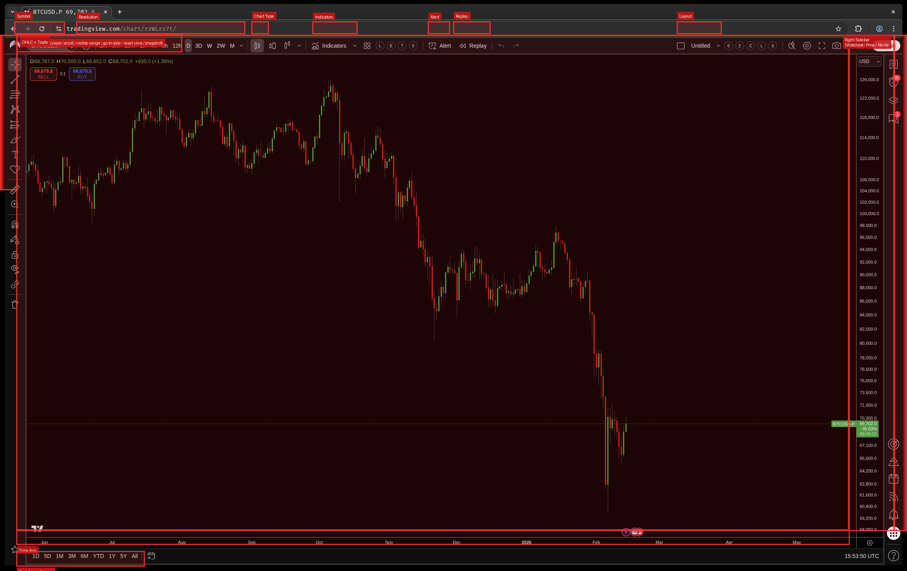

# API Coverage Map

Visual reference: [`chart_coverage.png`](chart_coverage.png) — red boxes show every UI region with programmatic API control.



## Covered Regions (170+ endpoints)

### Top Toolbar

| Region | Endpoints | What It Does |
|--------|-----------|--------------|
| **Symbol** | `GET/PUT /chart/{id}/symbol`, `GET /chart/{id}/symbol/info` | Read/change ticker (BTCUSD, AAPL, etc.), get extended metadata |
| **Currency / Unit** | `GET/PUT /chart/{id}/currency`, `GET /chart/{id}/currency/available`, `GET/PUT /chart/{id}/unit`, `GET /chart/{id}/unit/available` | Get/set price denomination currency and unit; list available options |
| **Resolution** | `GET/PUT /chart/{id}/resolution` | Change bar interval (1m, 5m, 1h, D, W, M, etc.) |
| **Chart Type** | `GET/PUT /chart/{id}/chart-type` | Switch between candles, bars, line, area, Heikin Ashi, etc. |
| **Indicators** | `GET/POST/PATCH/DELETE /chart/{id}/studies/*`, `POST /chart/{id}/indicators/search`, `POST /chart/{id}/indicators/add` | Add, modify, remove studies; search indicator library; manage favorites |
| **Compare/Overlay** | `POST /chart/{id}/compare`, `GET /chart/{id}/compare`, `DELETE /chart/{id}/compare/{study_id}` | Add overlay/compare symbols, list active comparisons, remove |
| **Alert** | Full CRUD on `/alerts/*` + stop/restart/clone/fires | Create, modify, delete, stop, restart, clone alerts; manage fired alerts |
| **Replay** | `/chart/{id}/replay/*` (activate, deactivate, step, autoplay, delay, status) | Enter replay mode, step bars, autoplay with configurable speed |
| **Layout** | `/layouts`, `/layout/*` (switch, save, clone, rename, delete, grid, batch-delete, preview, favorite) | Full layout management including multi-chart grid templates, favorite/star |

### Left Sidebar

| Region | Endpoints | What It Does |
|--------|-----------|--------------|
| **Drawing Tools** | `GET/POST/DELETE /chart/{id}/drawings/*`, clone, z-order, visibility, toggles (hide/lock/magnet), state export/import, tool selection, measure/zoom/eraser/cursor tools | Full drawing lifecycle — create, modify, clone, reorder, bulk export/import |

### Main Chart Area

| Region | Endpoints | What It Does |
|--------|-----------|--------------|
| **Viewport** | `POST zoom`, `POST scroll`, `PUT visible-range`, `GET visible-range`, `POST go-to-date`, `POST reset-view`, `POST undo`, `POST redo` | Zoom in/out, scroll bars, set exact visible range, jump to date, reset view, undo/redo |
| **Snapshot** | `POST /chart/{id}/snapshot`, `POST /browser_screenshot`, `GET/DELETE /snapshots/*` | Capture chart or full browser, list/download/delete snapshots |
| **OHLC Data** | `GET /chart/{id}/symbol/info` | Read current OHLCV values displayed in the header bar |
| **Multi-Pane** | `POST /chart/next`, `POST /chart/prev`, `POST /chart/maximize`, `POST /chart/activate`, `GET /chart/{id}/panes` | Tab between chart panes, maximize, activate by index |

### Price & Time Axes

| Region | Endpoints | What It Does |
|--------|-----------|--------------|
| **Price Axis** | `PUT /chart/{id}/visible-range`, `POST /chart/{id}/reset-scales` | Control vertical range via visible-range; reset scales |
| **Chart Toggles** | `GET /chart/{id}/toggles`, `POST /chart/{id}/toggles/log-scale`, `POST /chart/{id}/toggles/auto-scale`, `POST /chart/{id}/toggles/extended-hours` | Read/toggle log scale (Alt+L), auto scale (Alt+A), extended hours (Alt+E) |
| **Time Axis** | `PUT /chart/{id}/visible-range`, `POST /chart/{id}/scroll` | Control horizontal range via scroll and visible-range |
| **Timeframe Presets** | `PUT /chart/{id}/timeframe?preset=...` | Set 1D, 5D, 1M, 3M, 6M, YTD, 1Y, 5Y, All presets |

### Right Sidebar Panels

| Region | Endpoints | What It Does |
|--------|-----------|--------------|
| **Watchlists** | Full CRUD on `/watchlists/*`, active get/set, add/remove symbols, flag | Create, rename, delete watchlists; manage symbols; switch active list |
| **Pine Editor** | `/pine/*` (toggle, status, source get/set, save, add-to-chart, console, undo, redo, new-indicator, new-strategy, open-script, command-palette, and 10+ keyboard shortcuts) | Full Pine Script editing — read/write code, compile, add to chart, console output |
| **Alerts Panel** | Same as Alert above | Alerts accessible from both toolbar and sidebar |

### Strategy / Backtesting

| Region | Endpoints | What It Does |
|--------|-----------|--------------|
| **Strategy Tester** | `GET/PUT /chart/{id}/strategy/active`, `PUT /chart/{id}/strategy/input`, `GET /chart/{id}/strategy/report`, `GET /chart/{id}/strategy/date-range`, `POST /chart/{id}/strategy/goto` | Activate strategies, tune inputs, read backtest reports, navigate to trades |

### System

| Region | Endpoints | What It Does |
|--------|-----------|--------------|
| **Health** | `GET /health`, `POST /health/deep` | Basic and deep health checks (browser connection, tab state, chart readiness) |
| **Page Control** | `POST /page/reload`, `POST /layout/dismiss-dialog`, `POST /layout/fullscreen` | Reload page, dismiss modals, toggle fullscreen |
| **Introspection** | `GET /chart/{id}/chart-api/probe`, `GET /chart/{id}/chart-api/probe/deep`, `GET /chart/{id}/chart-api/resolve-symbol`, `PUT /chart/{id}/chart-api/timezone` | Probe internal APIs, resolve symbol metadata, switch timezone |

---

## Not Covered

### Toolbar buttons visible in screenshot — no API

| UI Element               | Location                  | Difficulty | Notes                                                                                                     |
| ------------------------ | ------------------------- | ---------- | --------------------------------------------------------------------------------------------------------- |
| **Templates**            | Top bar (grid icon)       | Medium     | Save/load chart appearance presets (colors, indicators, etc.). Dialog-driven, would need DOM interaction. |
| ~~**Log Scale (L)**~~    | Top bar                   | ~~Low~~    | **COVERED** — `POST /chart/{id}/toggles/log-scale` (Alt+L via CDP)                                        |
| ~~**Auto Scale (A)**~~   | Top bar                   | ~~Low~~    | **COVERED** — `POST /chart/{id}/toggles/auto-scale` (Alt+A via CDP)                                       |
| ~~**Extend Hours (E)**~~ | Top bar                   | ~~Low~~    | **COVERED** — `POST /chart/{id}/toggles/extended-hours` (Alt+E via CDP)                                   |
| ~~**Undo / Redo**~~      | Top bar (↶ ↷ arrows)      | ~~Low~~    | **COVERED** — `POST /chart/{id}/undo` (Ctrl+Z), `POST /chart/{id}/redo` (Ctrl+Y) via CDP                  |
| **Save Chart**           | Top bar (disk icon)       | Low        | Probably same as `POST /layout/save` but via the toolbar button. Already covered functionally.            |
| **Screenshot / Share**   | Top bar (camera icon)     | Low        | We have `POST /chart/{id}/snapshot` — functionally covered, just a different entry point.                 |
| **Settings Gear**        | Top bar (far right)       | Hard       | Opens the full chart properties dialog (colors, grid, scales, trading, events). Complex multi-tab dialog. |
| **Publish**              | Top bar (green button)    | N/A        | Publishes trading ideas to TradingView social. Out of scope for automation.                               |
| **Trade**                | Top bar (right of layout) | Hard       | Opens broker integration / order panel. Requires connected broker account.                                |
| ~~**USD Selector**~~     | Top right corner          | ~~Low~~    | **COVERED** — `GET/PUT /chart/{id}/currency`, `GET /chart/{id}/currency/available`, `GET/PUT /chart/{id}/unit`, `GET /chart/{id}/unit/available` |
| ~~**Star / Bookmark**~~  | Bottom left corner        | ~~Low~~    | **COVERED** — `GET /layout/favorite`, `POST /layout/favorite/toggle` via `_loadChartService` JS API       |
| **Calendar Icon**        | Bottom bar                | Low        | Toggle economic calendar view.                                                                            |

### Hidden panels — no API

| Feature               | Panel Location | Difficulty | Notes                                                                                                                                                                                                                                  |     |
| --------------------- | -------------- | ---------- | -------------------------------------------------------------------------------------------------------------------------------------------------------------------------------------------------------------------------------------- | --- |
| **Object Tree**       | Right sidebar  | Medium     | Lists all drawings and studies in a tree view. Read-only introspection — we already have `GET /drawings` and `GET /studies` which serve the same purpose.                                                                              |     |
| **Data Window**       | Right sidebar  | Medium     | Shows OHLCV + study values at cursor position. Would need cursor positioning + value extraction.                                                                                                                                       |     |
| **News**              | Right sidebar  | Hard       | Financial news feed from TradingView's data providers. Would need to scrape the news panel DOM or find an internal API.                                                                                                                |     |
| **Economic Calendar** | Bottom panel   | Hard       | Events feed (FOMC, CPI, etc.). Separate data source from chart data.                                                                                                                                                                   |     |
| **Screener**          | Bottom panel   | Hard       | Stock/crypto screener with filters. Complex filtering UI, separate from chart.                                                                                                                                                         |     |
| **Hotlists**          | Right sidebar  | Medium     | Most active, top gainers/losers. TradingView aggregates these server-side.                                                                                                                                                             |     |
| **Ideas / Community** | Right sidebar  | N/A        | Social trading ideas. Out of scope.                                                                                                                                                                                                    |     |
| **Trading Panel**     | Bottom panel   | Hard       | Order placement, positions, P&L. Requires broker connection. Out of scope for research tool.                                                                                                                                           |     |
| **Chart Properties**  | Modal dialog   | Hard       | Full settings dialog — appearance (colors, background, grid, watermark), scales (log, auto, percentage, lock), trading (positions, orders, executions), events (dividends, splits, earnings). Multi-tab dialog with dozens of options. |     |
| **Chart Templates**   | Modal dialog   | Medium     | Save/load named appearance configurations. Dialog-driven.                                                                                                                                                                              |     |

### Context menus & miscellaneous

| Feature | Difficulty | Notes |
|---------|------------|-------|
| **Right-click context menu** | Medium | Chart right-click shows: insert indicator, insert shape, add alert, object tree, chart settings, etc. These are alternate entry points for existing features. |
| **Drawing right-click** | Medium | Per-drawing context menu: settings, clone, bring to front, lock, remove. We already cover these via dedicated endpoints. |
| **Study right-click** | Medium | Per-study context menu: settings, remove, move to pane. Partially covered by PATCH/DELETE endpoints. |
| **Keyboard shortcut customization** | N/A | TradingView's built-in keybind editor. Not automatable or useful to automate. |
| **Multi-monitor / detach** | N/A | TradingView's multi-window feature. Out of scope for single-page automation. |

---

## Coverage Summary

```
Covered:          174+ endpoints across 17 major categories
Not covered:       ~16 features (see tables above)

Breakdown of gaps:
  Low difficulty:   4  (undo/redo, USD, star, calendar)
  Medium difficulty: 4  (templates, object tree, data window, hotlists)
  Hard difficulty:   5  (settings dialog, chart properties, news, screener, trading panel)
  Out of scope:      3  (publish, ideas/community, multi-monitor)
```

### What matters most

Everything that's missing falls into three buckets:

1. **Simple toggles** (log scale, auto scale, extended hours) — low effort to add
2. **Read-only panels** (news, calendar, screener, hotlists) — useful for data extraction but not chart control
3. **Out of scope** (trading/orders, social publishing) — not relevant for a research/automation tool

The core charting workflow — **symbol, resolution, chart type, studies, drawings, alerts, replay, strategies, watchlists, pine scripting, layouts, and snapshots** — is fully covered.
